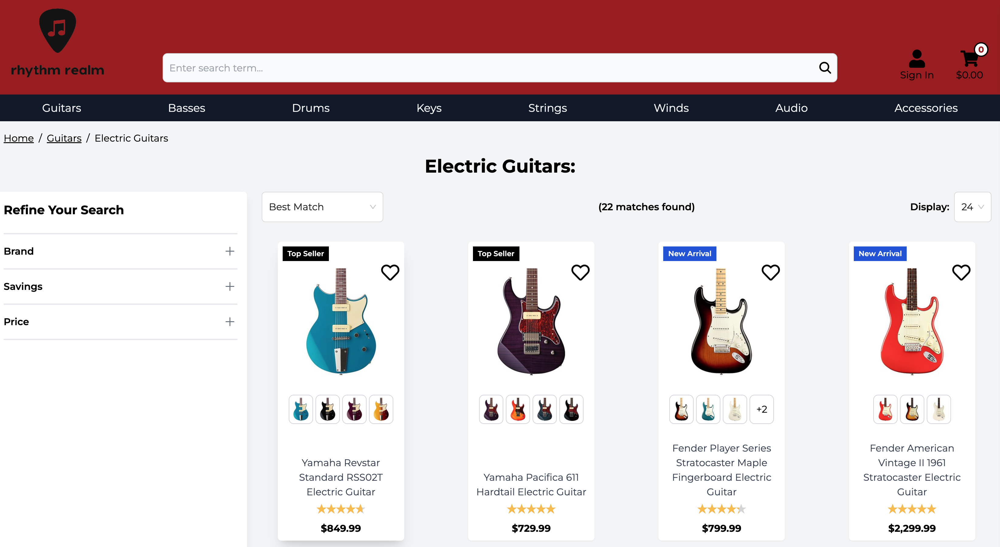

# 🎸 Rhythm Realm

**Rhythm Realm** is a full-stack e-commerce demo application built for portfolio purposes. It simulates an online store for musical instruments, allowing users to browse products, log in, manage a wishlist and cart, and simulate a checkout experience. This project showcases my ability to design and build a complete PERN (PostgreSQL, Express, React, Node.js) application.

---

## 🚀 Live Demo

[🔗 View Live Project](https://rhythm-realm.onrender.com/)



---

## 🎯 Project Goals

- Demonstrate full-stack development skills
- Implement typical e-commerce features
- Build a clean, responsive UI
- Handle state management and API integration

---

## ✨ Features

- User authentication using Passport.js
- Smart search across products, categories, and subcategories
- Add/remove items from cart
- Wishlist functionality
- Product ratings and reviews
- Product browsing and filtering
- Simulated checkout process
- Responsive design for mobile and desktop

---

## 🧰 Tech Stack

**Frontend:** React, TypeScript, Tailwind CSS, Redux  
**Backend:** Node.js, Express  
**Database:** PostgreSQL  
**Authentication:** Passport.js 

---

## 🛠 Installation & Setup

### Prerequisites
- Node.js
- Git


⚠️ This app connects to a private PostgreSQL database hosted on Render. For security reasons, the database credentials are not public.

If you'd like to run this project locally for learning or collaboration, please contact me directly.

---

### 🔧 Setup Instructions

```bash
# 1. Clone the repository
git clone https://github.com/yourusername/rhythm-realm.git
cd rhythm-realm

# 2. Install backend dependencies
npm install

# 3. Install frontend dependencies
cd views
npm install
```

--- 

## 👤 Author

**Your Name**  
[GitHub](https://github.com/rocklyn-r) • [LinkedIn](https://linkedin.com/in/antica-rocklyn-rusinovic)


## 📄 License

This project is for personal portfolio use and not licensed for commercial deployment.
